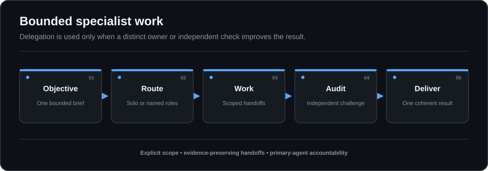

# Agent Team

Build complex AI work like a small, accountable project team.

Agent Team is an installable skill that turns a broad request into bounded role assignments, evidence-backed handoffs, and, for important work, an independently audited result. It is designed for work where discovery, analysis, construction, and verification should remain distinct.

The skill does not add agents for show. It applies a simple delegation gate: every role must own a distinct output or reduce a named risk. Straightforward work stays with one agent.



## What it brings to AI work

- **Clear ownership:** one owner for each decision and artifact.
- **Bounded access:** every role receives an explicit read, write, tool, and action scope.
- **Traceable reasoning:** claims, assumptions, gaps, and evidence travel with each handoff.
- **Deliberate sequencing:** dependent work happens in order, while safe independent work may run concurrently.
- **Independent review:** important outputs are checked by an Auditor before delivery.
- **One coherent result:** the Orchestrator resolves conflicts and answers the original request.

## Quick start

Agent Team is instruction-only. It requires no runtime dependencies, package manager, or external assets.

1. Copy the included `skill/agent-team-os` directory into the target workspace at `.agents/skills/agent-team-os/`.
2. Confirm the installed structure:

   ```text
   <workspace>/
   `-- .agents/
       `-- skills/
           `-- agent-team-os/
               |-- SKILL.md
               `-- agents/
                   `-- openai.yaml
   ```

3. Invoke the skill explicitly in Codex:

   ```text
   Use $agent-team-os to compare three vendors from the supplied briefs.
   Keep evidence extraction, comparative analysis, recommendation drafting,
   and independent audit distinct. Do not use external sources.
   ```

The included metadata also permits implicit invocation when a complex request clearly benefits from specialist routing. Explicit invocation is the clearest way to request the workflow.

### Package and install

The package builder is deterministic and writes a ZIP plus SHA-256 checksum.
It uses only the Python standard library:

```powershell
python .\scripts\validate.py
python .\scripts\package.py --output .\dist
Get-FileHash .\dist\agent-team-0.1.5.zip -Algorithm SHA256
Expand-Archive .\dist\agent-team-0.1.5.zip -DestinationPath .\dist\expanded
Copy-Item .\dist\expanded\agent-team-0.1.5\skill\agent-team-os $env:CODEX_HOME\skills\agent-team-os -Recurse -Force
```

On Bash:

```bash
python3 scripts/validate.py
python3 scripts/package.py --output dist
sha256sum dist/agent-team-0.1.5.zip
unzip -q dist/agent-team-0.1.5.zip -d dist/expanded
cp -R dist/expanded/agent-team-0.1.5/skill/agent-team-os "$CODEX_HOME/skills/agent-team-os"
```

Verify the checksum before copying. The package contains the skill, templates,
schemas, examples, validator, and release documentation. It does not publish
or change remote metadata.

## Good use cases

Use Agent Team when separate work products or independent review will improve the result. The repository includes three fully synthetic scenarios:

1. **Vendor comparison:** extract evidence from supplied capability briefs, compare options consistently, and audit the conclusion.
2. **Customer-support workflow design:** map the current state, analyze failure points, design a bounded future workflow, and test it against service goals.
3. **Small internal tool:** define acceptance criteria, implement within a narrow write scope, test behavior, and independently review delivery.

Detailed role briefs are available in [`examples/routing-scenarios.md`](examples/routing-scenarios.md). Reusable briefs and audit reports are in [`templates/`](templates/).

Keep a task with one agent when it is simple, self-contained, and does not benefit from a distinct specialist output or independent check.

## How the workflow operates

```text
Request -> frame -> route -> execute -> integrate -> audit -> deliver
```

1. **Frame the request.** Restate the outcome, constraints, available evidence, authorized actions, and completion test.
2. **Apply the delegation gate.** Add a role only when it produces a distinct output or reduces a specific risk.
3. **Write complete role briefs.** Define the role, access scope, task, evidence, output contract, and stop condition before work begins.
4. **Sequence the work.** Run dependent stages in order. Run independent stages concurrently only when their outputs cannot contaminate one another.
5. **Integrate the outputs.** Resolve contradictions instead of presenting incompatible conclusions side by side.
6. **Audit important results.** Classify findings as blocking, material, or minor; correct material issues; then recheck the changed work.
7. **Deliver one answer.** Summarize the outcome, evidence basis, assumptions, unresolved risks, and anything left incomplete.

## Task-scoped roles

| Role | Primary responsibility |
| --- | --- |
| **Orchestrator** | Frames the request, selects the minimum useful roles, sequences work, integrates outputs, and owns request satisfaction. |
| **Scout** | Gathers and organizes permitted evidence without silently converting missing information into conclusions. |
| **Analyst** | Interprets evidence, compares options, exposes assumptions, and explains trade-offs. |
| **Maker** | Creates or revises the requested artifact within the authorized write scope. |
| **Auditor** | Independently checks correctness, assumptions, contradictions, risks, uncertainty, and request satisfaction. |

Not every task needs every role. Roles are temporary assignments for one request, not persistent identities or trusted personas.

## The role brief contract

Every delegated role must receive:

- **Role:** the task-scoped assignment.
- **Access scope:** exact sources, tools, actions, and read or write limits.
- **Task:** the distinct question, artifact, or risk the role owns.
- **Evidence:** the inputs to inspect and the traceability required for claims.
- **Output contract:** the expected format, contents, quality bar, and recipient.
- **Stop condition:** the event that ends work, including completion, a blocking gap, or a scope conflict.

A role should not begin with missing fields, duplicate another role, or receive broader access than its task requires. The machine-readable contract is [`schemas/role-brief.schema.json`](schemas/role-brief.schema.json), and the dependency-light checker is [`scripts/validate.py`](scripts/validate.py).

## Safety boundaries

Agent Team improves coordination, but coordination is not access control.

- Treat role separation as an operating pattern, not a security boundary.
- Enforce real permissions through the execution environment.
- Grant only the access required for the assigned task.
- Do not allow a role to widen its scope, redefine the request, or invent authorization.
- Preserve uncertainty when evidence is missing, weak, or contradictory.
- Stop a role when it completes its contract, exhausts permitted evidence, needs wider scope, or reaches diminishing returns.
- Require explicit authorization before any consequential external action that was not already approved.
- Keep human review in the loop for consequential decisions and actions.

An Auditor is an independent check, not a guarantee. Confidence, silence, and role labels are not substitutes for evidence.

## Repository map

```text
agent-team-os/
|-- README.md                       # Overview, installation, and operating model
|-- LICENSE                         # MIT License
|-- SECURITY.md                     # Safe-use and reporting guidance
|-- CONTRIBUTING.md                 # Design rules and contribution process
|-- PROVENANCE.md                   # Creation, review, and evaluation record
|-- CHANGELOG.md                    # Version history
|-- VERSION                         # Current package version
|-- templates/
|   |-- role-brief.md               # Six-field role brief template
|   `-- audit-report.md             # Independent audit report template
|-- schemas/
|   `-- role-brief.schema.json      # Machine-readable role brief contract
|-- evals/
|   |-- tasks.json                  # Versioned synthetic evaluation fixtures
|   |-- result.schema.json           # Versioned result shape
|   |-- results.v0.1.json            # Calibration fixture, no performance claims
|   `-- README.md                   # Evaluation protocol and baseline
|-- scripts/
|   |-- validate.py                 # Dependency-light contract and link checker
|   `-- package.py                  # Deterministic ZIP and checksum builder
|-- docs/
|   `-- release-notes-0.1.0.md      # Versioned release notes (one per release)
|-- .github/workflows/ci.yml        # Pull request and push checks
|-- examples/
|   `-- routing-scenarios.md        # Three synthetic end-to-end scenarios
`-- skill/
    `-- agent-team-os/
        |-- SKILL.md                # Coordination instructions
        `-- agents/
            `-- openai.yaml         # Display metadata and invocation policy
```

## Limitations

- The skill is an instruction layer, not an execution engine, storage system, authorization mechanism, or isolation boundary.
- Output quality remains limited by the supplied evidence, available tools, model behavior, and enforced permissions.
- An Auditor can miss errors and cannot make unsupported claims reliable.
- Delegation adds overhead when roles overlap or the task is too small.
- Task-scoped roles do not provide durable identity, memory, authority, or trust across requests.
- Human judgment remains necessary before consequential use.

## Authorship and provenance

EauDoon directed, reviewed, and takes responsibility for the result. This public package uses synthetic scenarios. See [`PROVENANCE.md`](PROVENANCE.md) for the complete creation record.

Agent Team is an independent community project.

## License

Released under the MIT License. See [`LICENSE`](LICENSE).
